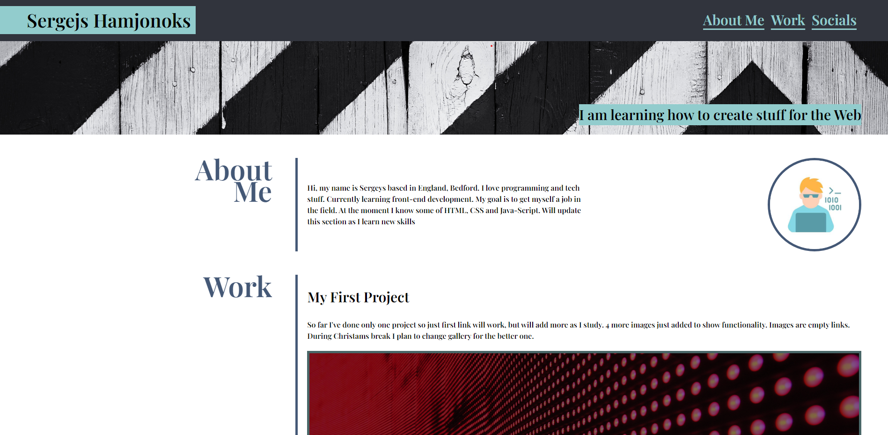

# Porftolio Website

Created by &copy;Sergejs Hamjonoks.

## Project Description

My first Porftolio website. Structure created using grid. Still can add some  
variables and reduce amount of code and make it cleaner.


## Screenshots




## Demo

https://heretotroll.github.io/Challenge2_SergejsHamjonoks/


## Technologies used

HTML with semantic elements and more advanced CSS


## License

[MIT](https://choosealicense.com/licenses/mit/)

## Installation

Install Challenge1 with Git Bash

1.Open Git Bash.  
2.Change the current working directory to the location where you want the project to be installed.


```bash
  cd DesiredProjectLocation
  git clone https://github.com/HereToTroll/Challenge2_SergejsHamjonoks.git
```
    